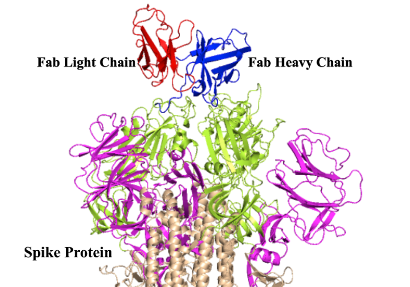

# A comprehensive study of single cell RNA data for COVID-19

The new occurance of COVID-19 have brought disaster to tens of countries in the world and great challenege for whole world health. Here we present a comprehensive study combining data from single cell RNA and bulk TCR/BCR sequencing data for deeply investigation of the relevant mechanism of the disease. Samples include 15 COVID-19 patients. 10x Genomics 5' RNA-Seq, immune profiling and bulk TCR/BCR Seq are conducted in their PBMC.

You can find all code and figures available in the each part of analysis here. For any detail, click into the sub-topic you like for check.

A structure schematic diagram of TCR and SARS-CoV-2 binding. 
