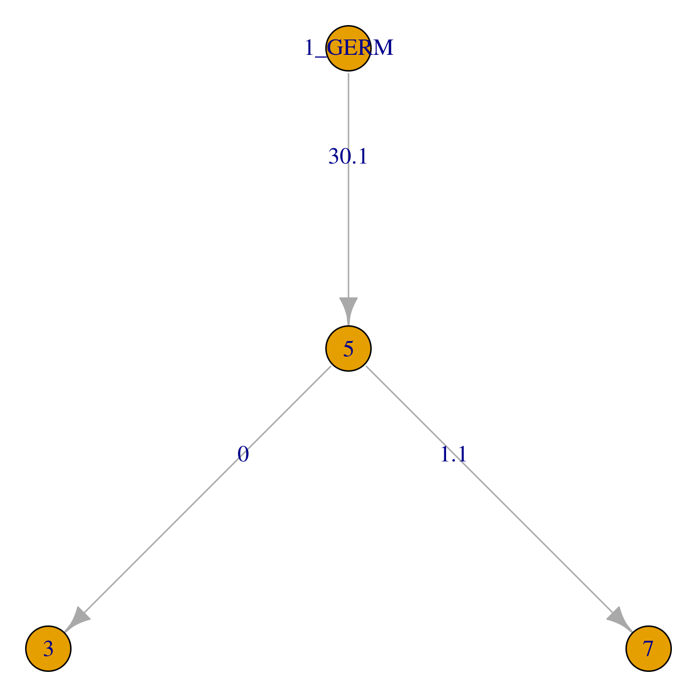

Using BuildTrees
===============================================================================

IgPhyML is easiest to use when run indirectly through the Change-O program 
`BuildTrees <https://changeo.readthedocs.io/en/stable/tools/BuildTrees.html>`__
by specifying the ``--igphyml`` option.
Most of these instructions require Change-O 0.4.6 or higher, Alakazam 0.3.0 or higher,
and IgPhyML to be installed, with the executable in your ``PATH`` variable. 
If these aren't possible, see :ref:`IgPhyML standalone operation <igphyml-standalone>`

To view all options for `BuildTrees <https://changeo.readthedocs.io/en/stable/tools/BuildTrees.html>`__
, run the command::

 BuildTrees.py --help

.. _BuildTrees-processing:

Controlling input
===============================================================================

The process begins with an AIRR formatted data file, in
which each sequence has been clustered into a clonal group,
which has subsequently had its unmutated V and J sequence predicted germlines.
The following column names are required in the input file: fields: ``sequence_id``,
``sequence``, ``sequence_alignment``, ``germline_alignment_d_mask``,
``v_call``, ``j_call``, and ``clone_id``. ``productive`` is recommended.
 
Use BuildTrees.py to break this file into separate sequence
alignment files that can be used with IgPhyML. This program will:

1. Filter out nonfunctional sequences.
2. Mask codons split by insertions.
3. Separate clonal groups into separate alignment files (aligned by IMGT site) and information files
4. Create the repertoire files for this dataset.

Create IgPhyML input files from ``examples/example.tab`` without running IgPhyML::
 
 cd examples
 BuildTrees.py -d example.tab --outname ex --log ex.log --collapse
 
Here the ``--collapse`` flag is used to
collapse identical sequences. This is highly recommended because
identical sequences slow down calculations without actually affecting
likelihood values in IgPhyML.

.. note::

    IgPhyML requires at least three sequences in a lineage, so in
    the case that there is only one observed sequence within a clone, that
    sequence is duplicated. This will not affect the likelihood
    calculation because these sequences will have a branch length of zero,
    but it will affect metrics that take sequence frequency into account.

.. _BuildTrees-subsampling:

Subsampling AIRR datasets
-------------------------------------------------------------------------------

IgPhyML runs slowly with more than a few thousand sequences. You can
subsample your dataset using the ``--sample`` and ``--minseq`` options,
which will subsample your dataset to the specified depth and then remove
all clones below the specified size cutoff::
 
 BuildTrees.py -d example.tab --collapse --sample 5 --minseq 2 --igphyml

.. _ind-clones:

Selecting individual clones        
-------------------------------------------------------------------------------

Often only particular clones are of interest for lineage tree analysis. To 
restrict IgPhyML analysis to particular clones, use the ``--clones`` option::

 #Only use sequences from clone 2:
 BuildTrees.py -d example.tab --collapse --clone 2 --igphyml

 #Only use sequences from clones 1 and 2:
 BuildTrees.py -d example.tab --collapse --clone 1 2 --igphyml

Cleaning up intermediates
-------------------------------------------------------------------------------

BuildTrees produces many intermediate files that are usually not useful to the user. 
To delete them after IgPhyML is run, use ``--clean all``::
 
 BuildTrees.py -d example.tab --log ex.log --collapse --igphyml --clean all

.. _ncdr3:

Removing the CDR3 region
-------------------------------------------------------------------------------

If you plan to analyze model parameters to study things such as SHM and
selection, it's important to remove
the CDR3 region to avoid known model biases in estimating :math:`\omega`. To
do this, use ``--ncdr3``::
 
 BuildTrees.py -d example.tab --log ex.log --collapse --ncdr3 --igphyml

.. _building-lineage-trees:

Building lineage trees
===============================================================================

If you're simply interested in getting some tree topologies, the fastest
option is to just use the GY94 and not estimate any parameters
under HLP19. This is done using the ``--optimize n`` option::

 BuildTrees.py -d example.tab --collapse --igphyml --clean all --optimize n

The trees can then be visualized using 
`igraph and Alakazam <https://alakazam.readthedocs.io/en/stable/vignettes/Lineage-Vignette/#plotting-of-the-lineage-tree>`__. 
Open an ``R`` session::

 library(alakazam)
 library(igraph)
 
 db = readIgphyml("example_igphyml-pass.tab")

 #plot largest lineage tree
 plot(db$trees[[1]],layout=layout_as_tree)

   Graph-formatted lineage tree of example clone 1.

Run ``dev.off()`` after plotting if using the Docker image to create a pdf. 
In these plots, edge labels represent the expected number of substitutions between
nodes in the tree. See the Alakazam 
`documentation <https://alakazam.readthedocs.io/en/stable/vignettes/Lineage-Vignette/#plotting-of-the-lineage-tree>`__ for plotting this style of trees.
Alternatively, more traditional bifurcating tree topologies can
be used::

 library(alakazam)
 library(ape)

 db = readIgphyml("example_igphyml-pass.tab",format="phylo")

 #plot largest lineage tree
 plot(db$trees[[1]])

   Phylo-formatted lineage tree of example clone 1.

Of course, these are quite simple trees. A more interesting tree can be 
visualized from a different provided dataset::

 library(alakazam)
 library(ape)

 db = readIgphyml("sample1_igphyml-pass.tab",format="phylo")
 
 #plot largest lineage tree
 plot(ladderize(db$trees[[1]]),cex=0.7,no.margin=TRUE)

   Phylo-formatted lineage tree of a larger B cell clone.

Alternatively, to estimate ML tree topologies using the HLP19 model, use::
 
 BuildTrees.py -d example.tab --collapse --igphyml --clean all --optimize tlr
 
This will be slower than using the GY94 model but does return meaningful HLP19 parameter estimates.
These results can be visualized in the same manner using Alakazam.

.. _igphyml-parameters:

Evolutionary hypothesis testing
===============================================================================

The HLP19 model
-------------------------------------------------------------------------------

The HLP19 model is the heart of IgPhyML and adjusts for features of
affinity maturation that violate the assumptions of most other
phylogenetic models. It uses four sets of parameters to characterize
the types of mutations the occurred over a lineage’s development, and
to help build the tree.
 
:math:`\omega`: Also called dN/dS, or the ratio of nonsynonymous
(amino acid replacement) and synonymous (silent) mutation rates. This
parameter generally relates to clonal selection, with totally neutral
amino acid evolution having an :math:`\omega \approx 1`, negative
selection indicated by :math:`\omega < 1` and diversifying selection
indicated by :math:`\omega > 1`. Generally, we find a lower :math:`\omega`
for FWRs than CDRs, presumably because FWRs are more structurally
constrained.
 
:math:`\kappa`: Ratio of transitions (within purines/pyrimidines) to
transversions (between purines/pyrimidines). For normal somatic
hypermutation this ratio is usually :math:`\approx 2`.
 
Motif mutability (e.g. :math:`h^{WRC}`): Mutability parameters for
specified hot- and coldspot motifs. These estimates are equivalent to
the fold-change in mutability for that motif compared to regular
motifs, minus one. So, :math:`h^{WRC} > 0` indicates at hotspot,
:math:`h^{WRC} < 0` indicates a coldspot, and :math:`h^{WRC} = 2`
indicates a 3x increase in *WRC* substitution rate. The HLP19 model
by default estimates six motif mutability parameters: four hotspots
(WRC, GYW, WA, and TW) and two coldspots (SYC and GRS).

.. _parameter-specification:

Specifying parameters
-------------------------------------------------------------------------------

Substitution parameters are specified using the ``-t`` for :math:`\kappa`
(transition/transverion rate), ``--omega`` for :math:`\omega`
(nonsynonymous/synonymous mutation rate), and ``--motifs`` and
``--hotness`` for specifying the motif mutability models. The default
for all of these is to estimate shared parameter values across all
lineages, which is also specified by ``e``.

Due to default parameter settings, the following two commands are equivalent::
 
 BuildTrees.py -d example.tab --collapse --igphyml
 
 BuildTrees.py -d example.tab --collapse --igphyml -t e --omega e,e \
  --motifs WRC_2:0,GYW_0:1,WA_1:2,TW_0:3,SYC_2:4,GRS_0:5 \
  --hotness e,e,e,e,e,e --optimize lr
 
Note that here we use ``--optimize lr``, which will keep tree topologies the 
same and only estimate branch lengths and substitution parameters. This will keep topologies
the same as the GY94, but will estimate substitution parameters much
more quickly. Using ``--optimize tlr`` will also optimize tree topology, using
``--optimize r`` will only optimize model parameters, and ``--optimize n`` will not
optimize topology, branch lengths, or model parameters.

The default setting is to estimate a separate :math:`\omega` parameter for FWR
and CDR regions. If you want one :math:`\omega` for all regions, use::

 BuildTrees.py -d example.tab --collapse --igphyml --omega e

You can also constrain motifs to have the same mutabilities
by altering the indexes after the ':' in the ``--motifs`` option.
For motif mutability, each value
in the ``--hotness`` option corresponds to the index specified in
the ``--motifs`` option. For example, to estimate a model in
which WRC/GYW, WA/TW, and SYC/GRS motifs are respectively constrained
to have the same mutabilities, use::

 BuildTrees.py -d example.tab --collapse --igphyml \
  --motifs WRC_2:0,GYW_0:0,WA_1:1,TW_0:1,SYC_2:2,GRS_0:2 \
  --hotness e,e,e

.. _ci-estimation:

Confidence interval estimation
-------------------------------------------------------------------------------

It is possible to estimate 95% confidence intervals for any of these
parameters by adding a 'c' to the parameter specification. For example,
to estimate a 95% confidence interval for :math:`\omega _{CDR}` 
but not :math:`\omega _{FWR}`, use::

 BuildTrees.py -d example.tab --collapse --ncdr3 --clean all --igphyml --omega e,ce

To estimate a 95% confidence interval for :math:`\omega _{FWR}` 
but not :math:`\omega _{CDR}`, use::

 BuildTrees.py -d example.tab --collapse --ncdr3 --clean all --igphyml --omega ce,e

Any combination of confidence interval specifications can be used
for the above parameter options. For instance, to estimate confidence 
intervals for GYW mutability, use::

 BuildTrees.py -d example.tab --collapse --ncdr3 --clean all --igphyml --hotness e,ce,e,e,e,e

which is equivalent to::

 BuildTrees.py -d example.tab --collapse --ncdr3 --clean all --igphyml \
  --motifs WRC_2:0,GYW_0:1,WA_1:2,TW_0:3,SYC_2:4,GRS_0:5 \
  --hotness e,ce,e,e,e,e

Remember it is important to :ref:`remove the CDR3 region <ncdr3>` for this kind of analysis.
You can find further explanation of the different options in the
commandline help page of BuildTrees, including controlling output
directories and file names.

Visualizing results
-------------------------------------------------------------------------------

Model hypothesis testing can be easily accomplished with the `Alakazam <https://alakazam.readthedocs.io>`__
functions `readIgphyml <https://alakazam.readthedocs.io/en/stable/topics/readIgphyml/>`__ and 
`combineIgphyml <https://alakazam.readthedocs.io/en/stable/topics/combineIgphyml/>`__.
In this example,
we first run IgPhyML on an example file and estimate confidence intervals on :math:`\omega _{CDR}`::

 BuildTrees.py -d example.tab --collapse --nproc 2 --ncdr3 --clean all --igphyml --omega e,ce

Then, open an ``R`` session, where we load the example result and two other samples. 
To compare maximum likelihood parameter estimates for all samples, use (run 
``dev.off()`` after plotting if using the Docker image to create a pdf)::

 #!/usr/bin/R
 library(alakazam)
 library(ggplot2)

 #read in three different samples
 ex = readIgphyml("example_igphyml-pass.tab",id="EX")
 s1 = readIgphyml("sample1_igphyml-pass.tab",id="S1")
 s2 = readIgphyml("sample2_igphyml-pass.tab",id="S2")

 #print out parameter values
 print(ex$param[1,])

 #combine objects into a dataframe
 comb = combineIgphyml(list(ex,s1,s2),format="long")

 ggplot(comb[grepl("MLE",comb$variable),],
    aes(x=ID,y=variable,fill=value)) + geom_tile() +
    theme_bw() + scale_fill_distiller(palette="RdYlBu")

   Maximum likelihood HLP19 parameter estimates for three samples.

Maximum likelihood point estimates of each parameter are specified with "_MLE", while
upper and lower confidence interval bounds of a parameter are specified with "_UCI" and
"_LCI" respectively. Which estimates are available is controlled 
:ref:`by the model specified <parameter-specification>` and whether :ref:`confidence intervals<ci-estimation>`
were estimated when running IgPhyML.

properly test the hypothesis that :math:`\omega _{CDR}` parameter estimates are significantly
different among these datasets, use::
    
 #!/usr/bin/R
 library(alakazam)
 library(ggplot2)

 #read in three different samples
 ex = readIgphyml("example_igphyml-pass.tab",id="EX")
 s1 = readIgphyml("sample1_igphyml-pass.tab",id="S1")
 s2 = readIgphyml("sample2_igphyml-pass.tab",id="S2")

 #combine objects into a dataframe
 comb = combineIgphyml(list(ex,s1,s2),format="wide")
 
 #compare CDR dN/dS for three samples
 ggplot(comb,aes(x=ID,y=OMEGA_CDR_MLE, ymin=OMEGA_CDR_LCI,
   ymax=OMEGA_CDR_UCI)) + geom_point() + 
   geom_errorbar(width=0.1) + theme_bw()

   95% confidence intervals for :math:`\omega _{CDR}` of three samples.

Where we can see that the confidence interval for Sample 1 does not overlap with the confidence
interval for Sample 2, meanging we conclude Sample 1 has significantly lower :math:`\omega _{CDR}`
than Sample 2. However, the confidence intervals for our example file (ex) are too wide to reach 
any firm conclusion.          

Optimizing performance
===============================================================================

IgPhyML is a computationally intensive program. There are some ways to
make calculations more practical, detailed below.

Data subsampling: IgPhyML runs slowly with more than a few thousand sequences. You can
subsample your dataset using the ``--sample`` and ``--minseq`` options in
BuildTrees.py, which will subsample your dataset to the specified depth and
then remove all clones below the specified size cutoff (see :ref:`Subsampling
Change-O datasets <BuildTrees-subsampling>`).

Analyzing specific clones: The ``--clone`` option can be used to analyze :ref:`only the 
specified clones<ind-clones>`.

Parallelizing computations: It is possible to parallelize likelihood
calculations by splitting computations across multiple cores using the
``--nproc`` option. Currently, calculations are parallelized by tree, 
so there is no use in using more threads than lineages.
 
Enforcing minimum lineage size: Many repertoires often contain huge
numbers of small lineages that can make computations impractical. To
limit the size of lineages being analyzed, specify a cutoff with
``--minseq`` when running BuildTrees.py.

