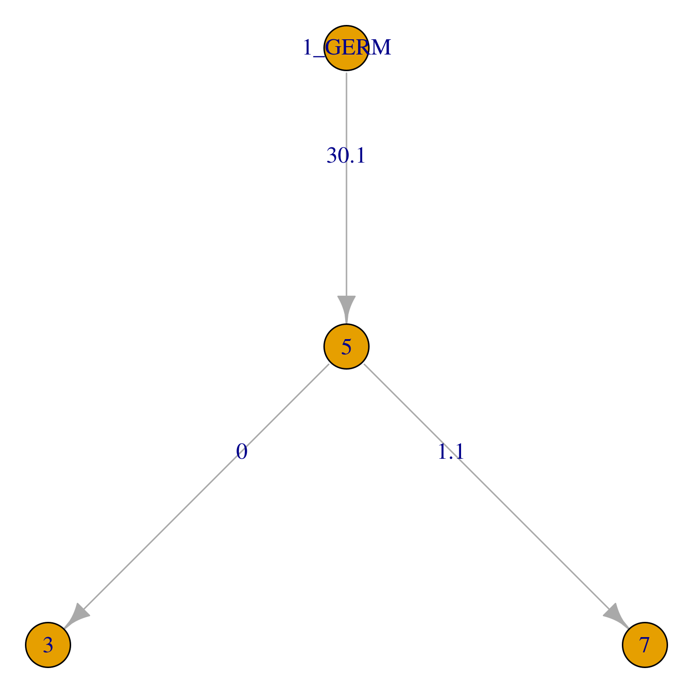

.. _igphyml-quickstart: 

Quick start
===============================================================================

IgPhyML is easiest to use when run indirectly through the Change-O program 
`BuildTrees <https://changeo.readthedocs.io/en/stable/tools/BuildTrees.html>`__
by specifying the ``--igphyml`` option.
Most of these instructions require Change-O 0.4.6 or higher, Alakazam 0.3.0 or higher,
and IgPhyML to be installed, with the executable in your ``PATH`` variable. 
If these aren't possible, see :ref:`IgPhyML standalone operation <igphyml-standalone>`

To view all options for `BuildTrees <https://changeo.readthedocs.io/en/stable/tools/BuildTrees.html>`__
, run the command::

 BuildTrees.py --help

The following commands should work as a first pass on many reasonably sized
datasets, but if you really want to understand what’s going on or make
sure what you’re doing makes sense, please check out the rest of the
website.
 
Build trees and estimate model parameters
-------------------------------------------------------------------------------
 
Move to the ``examples`` subfolder and run::

    BuildTrees.py -d example.tab --outname ex --log ex.log --collapse \
        --sample 3000 --igphyml --clean all --nproc 1
 
This command processes an AIRR-formatted dataset of BCR sequences that have been
`clonally clustered <https://changeo.readthedocs.io/en/stable/examples/cloning.html>`__
with `germlines reconstructed <https://changeo.readthedocs.io/en/stable/examples/germlines.html>`__.
It then quickly builds trees using the GY94 model and, using these
fixed topologies, estimates HLP19 model parameters. This can be sped up by
increasing the ``--nproc`` option. Subsampling using the ``--sample`` option in isn't 
strictly necessary, but IgPhyML will run slowly when applied to large datasets. 
Here, the ``--collapse`` flag is used to collapse identical sequences. This is 
highly recommended because identical sequences slow down calculations without 
affecting likelihood values in IgPhyML.

Visualize results
-------------------------------------------------------------------------------

The output file of the above command can be read using the 
`readIgphyml <https://alakazam.readthedocs.io/en/stable/topics/readIgphyml>`__ 
function of 
`Alakazam <https://alakazam.readthedocs.io>`__.
After opening an ``R`` session, enter the following commands. Note that 
when using the Docker container, you'll need to run ``dev.off()`` after 
plotting the tree to create a pdf plot in the ``examples`` directory::

 library(alakazam)
 library(igraph)
 
 db = readIgphyml("ex_igphyml-pass.tab")

 #plot largest lineage tree
 plot(db$trees[[1]],layout=layout_as_tree)

 #show HLP10 parameters
 print(t(db$param[1,]))
 CLONE         "REPERTOIRE"
 NSEQ          "4"         
 NSITE         "107"       
 TREE_LENGTH   "0.286"     
 LHOOD         "-290.7928" 
 KAPPA_MLE     "2.266"     
 OMEGA_FWR_MLE "0.5284"    
 OMEGA_CDR_MLE "2.3324"    
 WRC_2_MLE     "4.8019"    
 GYW_0_MLE     "3.4464"    
 WA_1_MLE      "5.972"     
 TW_0_MLE      "0.8131"    
 SYC_2_MLE     "-0.99"     
 GRS_0_MLE     "0.2583"

   Lineage tree of example clone.